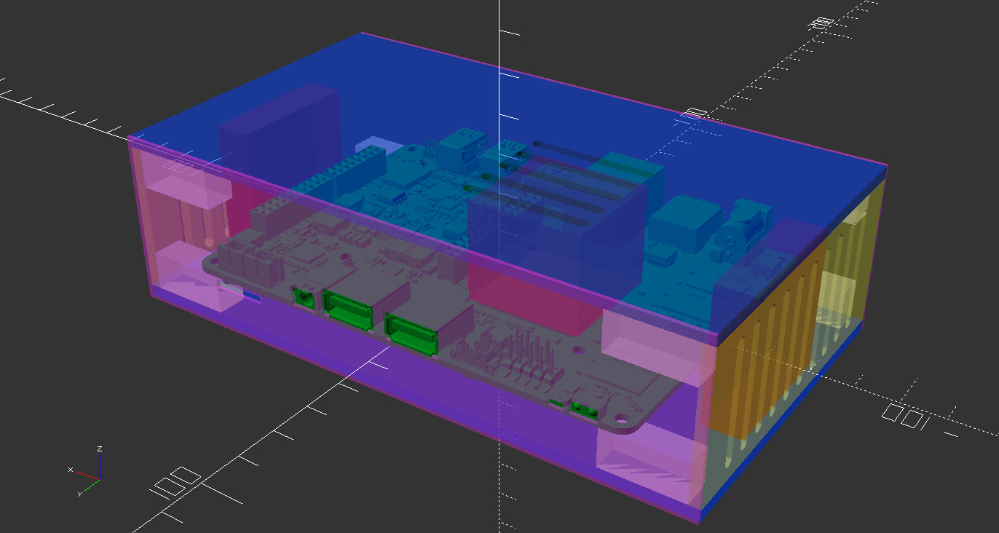
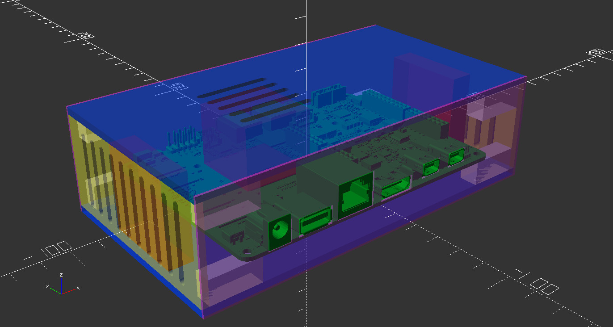
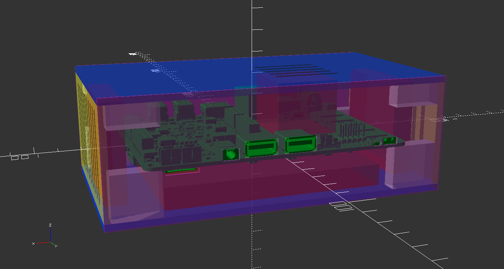
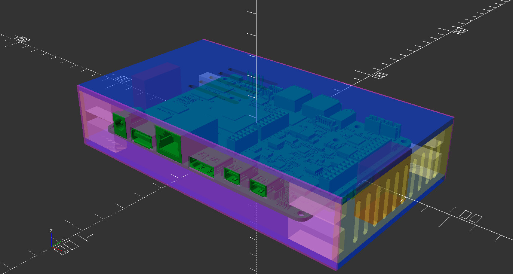

What is this?
-------------

This repository contains an openscad file which allows you to customize a case designed to fit the Udoo x86. There are a couple of parameters you can tweak at the top of the "code" which will allow you to customize the case in different ways (mostly the dimensions of things). I haven't yet had this case printed, but the idea is that using this code, you could 3d print or maybe laser cut acrylic pieces and assemble a case for your Udoo x86 board. My needs were such that I wanted a really cheap really small pc that could do the job of streaming television. I wasn't so much interested in the "maker" aspects of the board (maybe later when I have more free time). I also wanted to keep the height of the case as low profile as I could so instead of opting for the fan on top of the heatsink I've configured optional case fans on the ends (increasing the length of the case but not the height). My current plan is to have this laser cut and try it out. The biggest issue I'm expecting will be the material used for the io panels. The best option would be standard really thin metal, as normal io shields use but having thin metal laser cut is quite expensive. There are other quite thin but less strong options made of plastics so I think I might go that route.

Getting started
---------------

Disclaimer: I have done all of this on ubuntu so you're on your own with other non-obviously adaptable OS's...

Anyway, Udoo have provided a 3d step format model of the udoo x86 board. The documentation says

> 3D model does not respects faithfully the real size of the componets, please for your design verify the component size with the official manufacturer datasheet .

but it seemed pretty darn close to the real thing so I based the case off of that. The problem is openscad doesn't have the ability to load step format so first off we have to convert it. To do that try the following:

```bash
#get freecad and openscan
sudo apt-get -y install freecad openscad
#go get the udoo step file
wget http://udoo.org/download/files/mechanical_specs/udoo_x86_3d_model_revH.zip
unzip udoo_x86_3d_model_revH.zip
#use the freecad python modules to convert the step file to stl format
PYTHONPATH=$(dirname $(dpkg --listfiles freecad | grep -E 'FreeCAD\..*so$')) python -u ./convert.py csb02revh_idf_02_01_cfg01.STEP udoo_x86.stl
#wait a bit for it to do the conversion...
openscad udoo_x86.scad
```

So above we download the zip file containing the step file, unzip it, install freecad, and run the `convert.py` script included in this repository to turn the step file into an stl file which openscad can load. After that just crack open the `udoo.scad` file and you should be able to play with the case model.


What does it look like?
-----------------------

Without changing any of the setting the basic setup looks like this:





You can change the `ssd_depth` parameter to be 10mm or more and an ssd will be rendered in the preview:



But what I want to try to do is make a custom low profile heat sink that actually comes out over top of the ram modules so it has larger surface area but less height. The reason for that is I want to make the case has thin as possible. To see what that would look like I set the `hs_height` parameter to `13` and it no longer renders the stock heat sink but the case gets much slimmer. Maybe something like this is possible:



Dimensions
----------

In some of the images you can get an idea of the rough dimensions and with some parsing of the `scad` file you can calculate them exactly. For reference the case is 87mm wide, 134mm long (plus the depth of each case fan). Depending on your setup the height could be anywhere from 32mm for the slim version up to 65mm for an ssd and the stock heatsink with the stock fan mounted on top of it.
